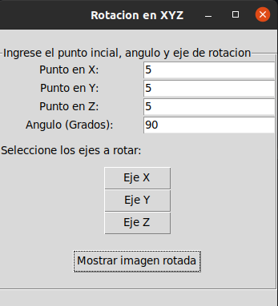
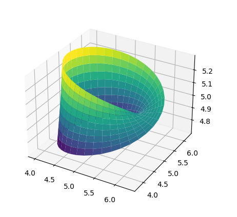
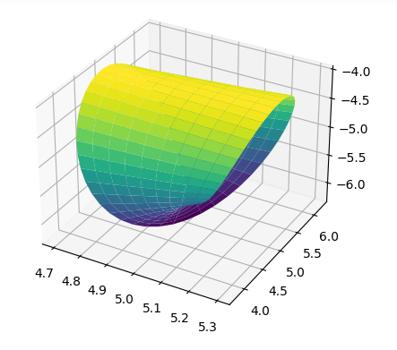
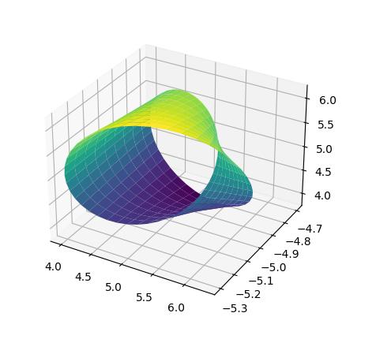

# Rotation in the x,y and z axis of a Möbius band 

------------

I made an app where you can rotate a Möbius band, in the axis that you want, and specify the degree to rotate. Also, you can specify the initial point.

In my first attempt I have tried using a structured paradigm (cde9da0 commit) but after watched POO curse, I made it in Object-Oriented paradigm (last commit).  

 *App Interface*
 

*Möbius band without rotation*

*Möbius band with a X rotation*

*Möbius band with a X rotation and a Y rotation*
